# Transformer from Scratch for Clinical NER

A transformer encoder implemented from first principles in PyTorch (no HuggingFace model shortcuts), trained on biomedical named entity recognition. Built to understand — and be able to explain — every architectural decision behind the transformer, not just use one.

## Problem

Named entity recognition on clinical/biomedical text — detecting chemical and disease mentions in scientific abstracts — is a standard benchmark task (BC5CDR) and a real-world need (drug safety monitoring, literature mining, adverse event detection). Most practitioners can use a pretrained BERT for this in a few lines of HuggingFace code, but can't explain what's happening inside it. This project builds the encoder from scratch to close that gap.

## Architecture

- Token embeddings scaled by `sqrt(d_model)`, combined with fixed sinusoidal positional encoding
- Scaled dot-product attention, multi-head attention with combined QKV projections
- Pre-LayerNorm encoder blocks (norm before sublayer, not after) with residual connections
- Position-wise feed-forward network (ReLU)
- 4-layer encoder stack, final LayerNorm, linear token classification head
- ~9.9M parameters total

See [`DECISIONS.md`](DECISIONS.md) for the reasoning behind each of these choices — why pre-LN over post-LN, why sinusoidal over learned positions, why masking happens before softmax, and more.



## Dataset

[BC5CDR](https://www.ncbi.nlm.nih.gov/research/bionlp/Data/disease/) (BioCreative V CDR), a biomedical NER benchmark annotated for chemical and disease entities, loaded via [CoNLL-format files](https://github.com/shreyashub/BioFLAIR) (BIO tagging scheme). The data pipeline includes subword-to-word label alignment, the trickiest part of token classification — see `src/data/dataset.py` and `tests/test_alignment.py`.

## Results

| Model | Parameters | Epochs | Precision | Recall | F1 |
|---|---|---|---|---|---|
| **From-scratch transformer** | 9.9M | 20 | 0.6306 | 0.6967 | **0.6620** |
| BERT-base (fine-tuned) | 110M | 5 | 0.8678 | 0.8780 | **0.8728** |

The ~21-point F1 gap is the headline finding, not a shortcoming to hide: BERT's pretraining on a massive general corpus gives it a huge head start that a from-scratch model trained on ~3,942 sentences simply can't match. The gap is itself evidence of how much pretraining matters — see `DECISIONS.md` for a fuller discussion, including a finding that validation loss and entity-level F1 don't always agree on which checkpoint is "best."


## Reproducing the results

```bash
# Install dependencies
pip install -r requirements.txt --break-system-packages

# Download the data
bash data/download.sh

# Train the from-scratch model (~10 min on Apple Silicon MPS)
python3 run_training.py

# Train the BERT baseline for comparison (~18 min)
python3 run_bert_baseline.py

# Verify a checkpoint reproduces its claimed metrics
python3 verify_checkpoint.py checkpoints/best_model.pt

# Run the test suite
python3 -m pytest tests/ -v
```

Tested on Apple Silicon (MPS backend); falls back to CUDA or CPU automatically if MPS is unavailable. Seeding (`seed: 42` in `config.yaml`) is verified deterministic for model initialization on MPS.

## Testing

~30 tests across attention mechanics, encoder behavior, data alignment, training utilities, and evaluation metrics. Run with:

```bash
python3 -m pytest tests/ -v
```

## What I'd do differently

- Train for fewer epochs (validation loss plateaus around epoch 6; F1 keeps slowly improving through epoch 19 — the two metrics disagree on the "best" checkpoint, see `DECISIONS.md`)
- Try GELU instead of ReLU in the feed-forward block, matching what BERT/GPT use
- Add a CRF layer on top of the classification head — would likely help entity boundary precision, a common technique I deliberately skipped here to keep the architecture interpretable